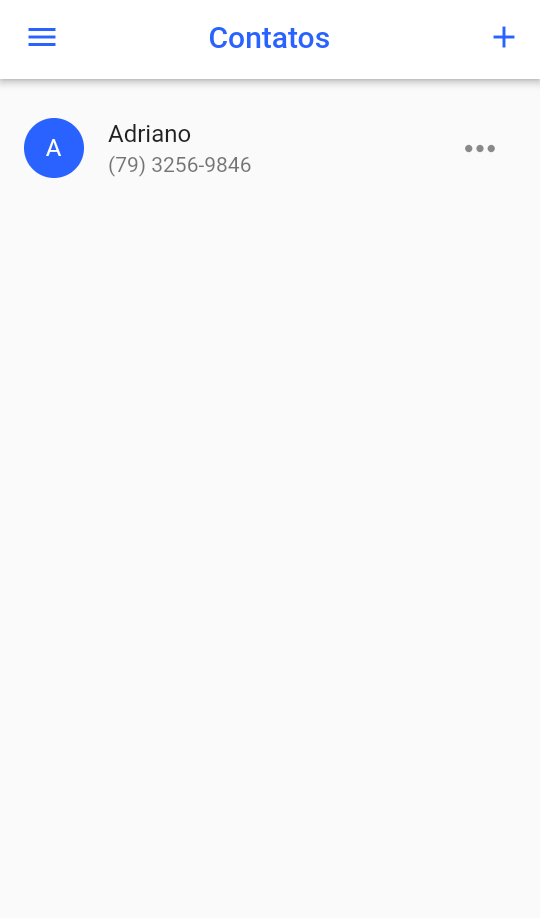
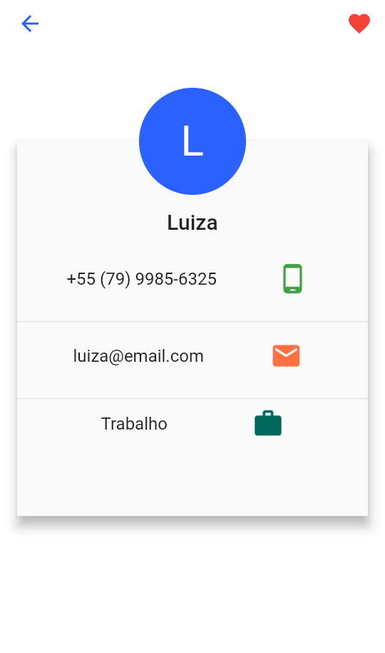

# Contato App

## Descrição do Projeto
Esse projeto tem como objetivo desenvolver um app de gerenciamento de contatos em Flutter. Ele utiliza o MobX para a realização do gerenciamento de estado. Além disso, ele permite ligar e enviar e-mail para um contato específico.

O app foi construído com base no aplicativo desenvolvido no curso Primeiros Passos com Flutter da [Digital Innovation One](https://digitalinnovation.one/) e em outro app desenvolvido anteriormente por mim.

# Tabela de conteúdos

- [Status do projeto](status-projeto)
- [Como usar](#como-usar)
    - [Pré-requisitos](#pre-requisitos)
    - [Rodando o app](#rodando-app)
- [Tecnologias](#tecnologias)
- [Telas do Contato App](#telas-contato-app)
- [License](#license)

## Status do projeto
Concluído

## Como usar
### Pré-requisitos
Para executar o projeto é preciso ter instalado em sua máquina o [Flutter](https://flutter.dev/docs/get-started/install) e um editor como o [VSCode](https://code.visualstudio.com/) ou o [Android Studio](https://developer.android.com/studio) para trabalhar com o código do projeto.

### Rodando o app
```bash
# Clone este repositório
$ git clone https://github.com/hakkinenT/contato_app.git

# Abra o projeto no seu editor

# Instale as dependencias
$ flutter pub get

# Crie um emulador ou configure um dispositivo físico para rodar o app
$ Criar emulador no Android Studio https://developer.android.com/studio/run/managing-avds?hl=pt-br
$ Configurar dispositivo físico https://medium.com/@marcoshenriqueh393/como-configurar-dispositivos-f%C3%ADsicos-no-flutter-b3acbe02e895

# Execute a aplicação
$ flutter run
```
## Tecnologias
Para a construção desse projeto foram usadas as seguintes ferramentas:

- [Flutter](https://flutter.dev/docs/get-started/install)
- [Dart](https://dart.dev/)
- [MobX](https://mobx.netlify.app/getting-started/)

## Telas do Contato App

<p float="left">
    
    
    
</p>

<p float="left">
    
    
</p>


## License
MIT License